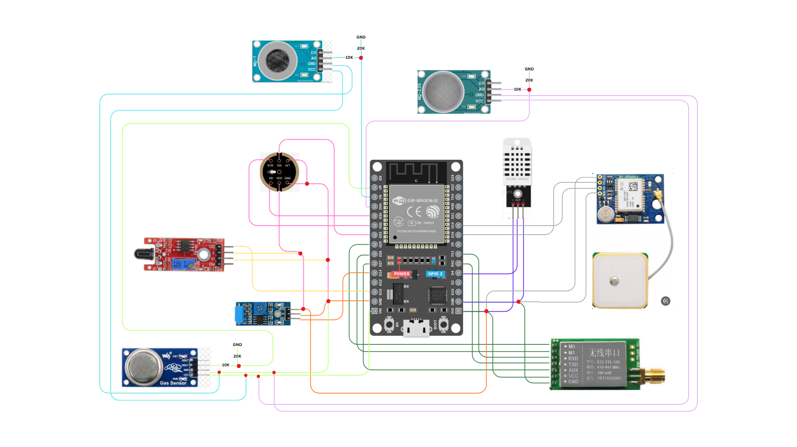

# ForestGuard AI

A reinforcement learning-driven, multi-hazard edge monitoring system for forests.

**Status: work in progress.** Major Project-1, B.Tech ECE, Jaypee Institute of Information Technology (JIIT), Noida.

## Problem

Forest fires, illegal logging, poaching and unauthorized activity are hard to catch early. Watchtowers and patrols are slow, and satellites give limited real-time coverage. Forests also often have no reliable internet, so cloud-only systems don't work there.

## What this project does

ForestGuard AI extends an existing three-tier edge framework for forest fire detection (Ali et al., *Internet of Things*, vol. 36, 2026) to cover more than fire. It adds:

- Acoustic and vibration sensing to detect chainsaws, gunshots and unauthorized movement
- A Q-Learning agent that tunes the escalation threshold, replacing the fixed threshold in the base paper
- A camera that stays off until an event is likely
- AODV routing over LoRa, so detection and alerting work offline
- A dashboard that collects human feedback on alerts

## Architecture

**Tier 1: sensing (ESP32)**
Reads the sensors, computes the Chandler Burning Index (CBI) fire index locally, and sends data onward only when a threshold is crossed. This saves energy and bandwidth.

**Tier 2: fusion (Raspberry Pi cluster head)**
- Random Forest for fire-risk classification
- CNN for sound event classification
- Rule-based fusion of both outputs with the vibration flag
- Q-Learning agent that tunes the fusion threshold
- Turns on a static camera and captures one image only when fusion confirms a likely event

**Tier 3: visual verification (software only)**
- CNN confirms fire or smoke in the captured image
- Object detection identifies a person, vehicle or animal
- Visual confirmation raises alert confidence but does not override the sensors. If the sensors confirm an event and the camera sees nothing, it is still reported and flagged for manual review.

**Alerts and feedback**
Confirmed events go to a dashboard with location and confidence, and to the forest department, patrol staff and the nearest fire station. A local buzzer and LED fire at the node right away. Users mark each alert as a real event or a false alarm, and that feedback is the reward signal for the Q-Learning agent.

## Hardware

| Tier | Components |
|------|------------|
| Tier 1 | ESP32, DHT22 (temperature, humidity), MQ-2 (smoke), MQ-7 (CO), MQ-135 (air quality), flame sensor, INMP441 I2S microphone, SW-420 vibration sensor, NEO-6M GPS, E32 LoRa module |
| Tier 2 | Raspberry Pi 4/5, LoRa receiver, Pi Camera, buzzer, LED, microSD card, USB power bank |

## Datasets

- Algerian Forest Fires Dataset (UCI) for fire-risk classification
- ESC-50 and UrbanSound8K for sound event classification

## Current progress

- [x] Literature review and gap analysis
- [x] Three-tier architecture and block diagram
- [x] Component selection and Tier 1 ESP32 wiring diagram
- [x] Dataset preprocessing (cleaning, normalising, labelling, train/validation/test split)
- [x] Algorithms finalised: CBI, Random Forest, CNN, rule-based fusion, Q-Learning
- [x] Simulated dashboard prototype (fire, illegal logging and false-alarm scenarios, with alerts and feedback)
- [ ] Tier 1 hardware integration and testing
- [ ] Model training and evaluation
- [ ] Tier 2 fusion logic and camera integration
- [ ] Q-Learning threshold tuning
- [ ] Tier 3 CNN and object detection integration
- [ ] AODV over LoRa communication
- [ ] End-to-end testing

No performance results are reported yet. This README will be updated as each stage is completed.

Supervisor: Dr. Manika Jha

## Reference

H. A. Ali, E. Ever, B. Kizilkaya, M. T. R. Khan, M. U. Rehman, S. Ansari, M. A. Imran, and A. Yazici, "An edge-intelligent three-tier framework for real-time forest fire detection, integrating WSNs, WMSNs, and UAVs," *Internet of Things*, vol. 36, p. 101861, 2026. https://doi.org/10.1016/j.iot.2025.101861
